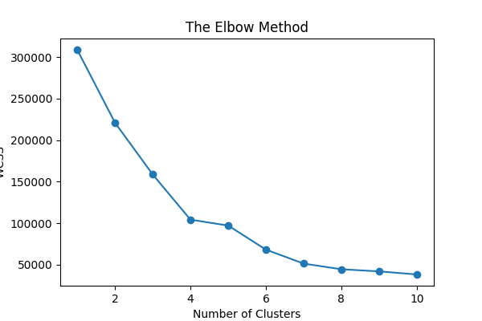
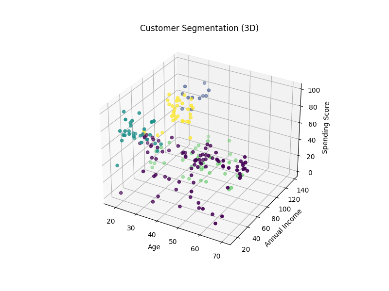

# 🛍️ Customer Segmentation using K-Means - PRODIGY_ML_02

## 📌 Task 2 - Machine Learning Internship

This project applies the K-Means clustering algorithm to group customers of a retail store based on their purchase behavior.

---

## 🎯 Objective

To segment customers into distinct groups based on:

* Age
* Annual Income
* Spending Score

---

## 📂 Dataset

The dataset contains customer details such as age, income, and spending habits, which are used to identify meaningful customer segments.

---

## 🧠 Project Workflow

* Data loading and preprocessing
* Feature selection
* Determining optimal clusters using the Elbow Method
* Applying K-Means clustering
* Visualizing customer segments in 3D

---

## 📊 Model Insights

* Used the Elbow Method to determine the optimal number of clusters
* Identified distinct customer groups based on spending behavior
* Provided insights into customer segmentation for business understanding

---

## 📈 Visualizations

* Elbow Method graph (to determine optimal clusters)
* 3D cluster visualization of customer segments

---

## 📷 Output




---

## 🛠️ Technologies Used

* Python
* Pandas
* Scikit-learn
* Matplotlib

---

## ▶️ How to Run

1. Install dependencies:

   ```bash
   pip install pandas matplotlib scikit-learn
   ```

2. Run the model:

   ```bash
   python model.py
   ```

---

## 📁 Project Structure

```
PRODIGY_ML_02/
│── model.py
│── Mall_Customers.csv
│── elbow.png
│── clusters_3d.png
│── README.md
```

---

## 🎯 Conclusion

This project strengthened my understanding of unsupervised learning and clustering techniques, and demonstrated how machine learning can be used to analyze customer behavior for better decision-making.

---

## 👤 Author

Rutuja Jilhawar

---

## 🔗 Connect with Me

[LinkedIn Profile](https://linkedin.com/in/rutuja-jilhawar-0a3647291)
